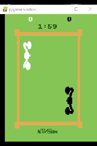
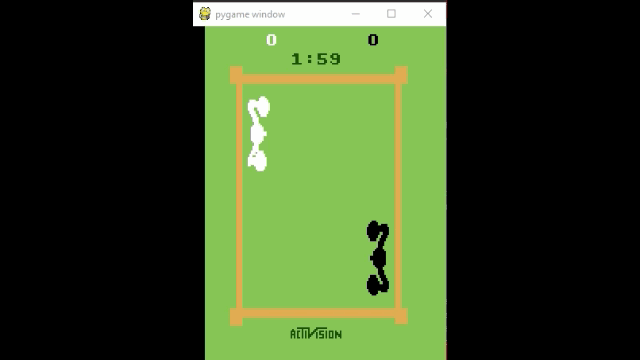

# [AtariGAIL: Imitation of human player behavior using Generative Adversarial Imitation Learning]()

### Introduction

This is my thesis project from IT University of Copenhagen. The main GAIL(Generative Adversarial Imitation Learning) algorithm
 is taken from [Andrew Liao's gail-tf repository](https://github.com/andrewliao11/gail-tf). 
 Few changes were made to apply GAIL on [Atari domain](https://gym.openai.com/envs/#atari).

Implementation of GAIL, attached with few examples from Atari games: *Boxing* & *MontezumaRevenge*.

### Requirements

1. Python 3.6
2. Tensorflow 1.11.0
3. Gym 0.10.9
4. Atari-py 0.1.7 

## Run the code

The main client `train.py` contains all needed tasks and algorithms:
* *'train_RL_expert'* -  train Reinforcement Learning agent using TRPO
* *'RL_expert'* - sample trajectories from RL expert from previous task
* *'human_expert'* - sample expert trajectories from a human game-play
* *'train_gail'* - run GAIL training with one of the experts
* *'play_agent'* - re-play the game using trained model
* *'evaluate'* - evaluate model

Algorithms can be chosen between TRPO and BC. Behavior cloning (BC) used mainly for pre-training of policy before GAIL training.

## Results
Boxing-ram-v0: Trained from 1 expert trajectory (`left video`) and from 1500 trajectories (`right video`):

    
   
   MontezumaRevenge-ram-v0:

 
### References

[gail-tf](https://github.com/andrewliao11/gail-tf)

[Atari games](https://gym.openai.com/envs/#atari)
