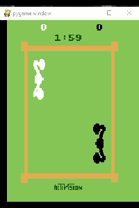
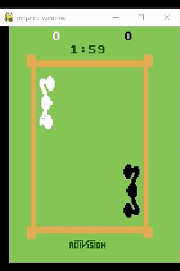
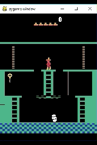
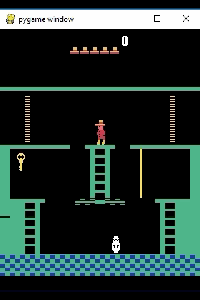
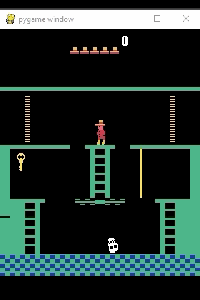

# [AtariGAIL: Imitation of human player behavior using Generative Adversarial Imitation Learning]()

### Introduction

This is my thesis project from IT University of Copenhagen. The main 
GAIL(Generative Adversarial Imitation Learning) algorithm implementation
 is taken from [Andrew Liao's gail-tf repository](https://github.com/andrewliao11/gail-tf). 
 Few changes were made to apply GAIL on [Atari domain](https://gym.openai.com/envs/#atari).

Implementation of GAIL, attached with few examples from Atari games: *Boxing* & *MontezumaRevenge*.

### Requirements

1. Python 3.6
2. Tensorflow 1.11.0
3. Gym 0.10.9
4. Atari-py 0.1.7 

## Run the code

The main client `train.py` contains all needed tasks and algorithms to run trainings:
* *'train_RL_expert'* -  train Reinforcement Learning agent using TRPO
* *'RL_expert'* - sample trajectories from RL expert from previous task
* *'human_expert'* - sample expert trajectories from a human game-play
* *'train_gail'* - run GAIL training with one of the experts
* *'play_agent'* - re-play the game using trained model

Algorithms can be chosen between TRPO and BC. Behavior cloning (BC) used mainly for pre-training of policy before GAIL training.
 #### 1. Train Reinforcement Learning expert.
 * Set Atari environment, for example: `args.env_id = 'MontezumaRevenge-ram-v0'`
 * Choose `args.task = 'train_RL_expert'` and `args.alg = 'trpo'`. 
 * Make sure that model path is None if 
 you start new training `args.load_model_path = None`. 
 * Run `train.py`. The model will be saved in 
 `data/training` directory. 
 * If you wish to continue previous training, then specify path to model.
 #### 2. Sample expert trajectories 
 ##### a. From trained RL model. 
 * Choose task `args.task = 'RL_expert'` and 
 a path to model: `args.load_model_path = 'data/training/trpo.Boxing-ram-v0.100.MD.1500/trpo.Boxing-ram-v0.100.MD.1500-0'` 
 without file extension. 
 * On line 47 specify a number of trajectories you need. 
 * Run `train.py`. It will save expert trajectories in `.pkl` file in directory `data/expert`.
 ##### b. From a human game-play
 * Choose task `args.task = 'human_expert'`.  
 * Run `train.py`. 
 * Play game. 
 * If you want to add a trajectory while playing, press `Esc` or wait until game over, it will add a trajectory automatically. To finish
 collecting of trajectories, close the pygame window. To cancel all progress, stop execution of program.
 #### 3. Train GAIL model
 * Set Atari environment, choose `args.task = 'train_gail'` and `args.alg = 'trpo'`. 
 * Choose path to expert `args.expert_path` and optionally `args.load_model_path`, if you want to continue with
 previous training.
 * To run GAIL with pre-trained weights, set `args.pretrained = True`
 * To pre-train model with Behavior cloning, choose `args.alg = 'bc'` instead of `trpo`. It will run BC and 
 save BC model, without running GAIL.
 

## Results
Imitation of RL agents in Boxing-ram-v0, trained from 1 expert trajectory (`left video`) and from 1500 trajectories (`right video`):

    
   
Imitation of human player in MontezumaRevenge-ram-v0:

    
   
    

 
### References

[gail-tf](https://github.com/andrewliao11/gail-tf)

[Atari games](https://gym.openai.com/envs/#atari)
